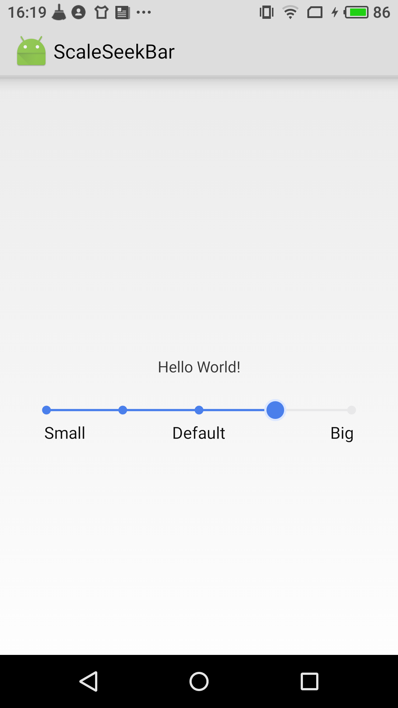

# ScaleSeekBar

with this view,  you can drag the point to some certain points in a line, which is better than android.view.seekbar.  when the progress is changed, this view will notify the listener the current progress.

at current , all the property is defined in init(),  if you want to use this library, you can modify it in init,  most variables are easy to know the meaning.

below is the screen short.

